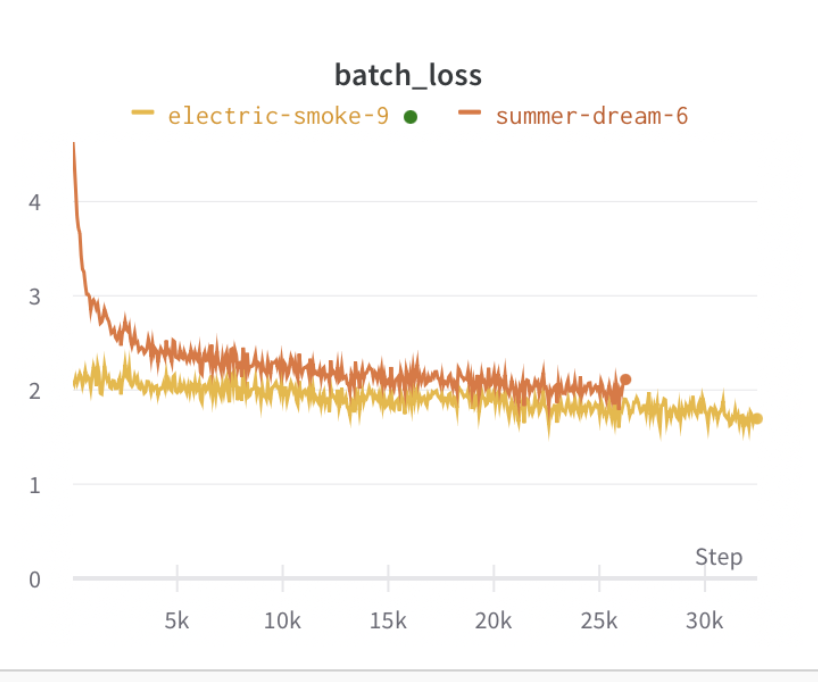

Based on the Deepmind paper [Improving language models by retrieving from trillions of tokens](https://arxiv.org/abs/2112.04426)
> We enhance auto-regressive language models by conditioning on document chunks retrieved from a large corpus, based on local similarity with preceding tokens. With a 2 trillion token database, our Retrieval-Enhanced Transformer (RETRO) obtains comparable performance to GPT-3 and Jurassic-1 on the Pile, despite using 25× fewer parameters. After fine-tuning, RETRO performance translates to downstream knowledge-intensive tasks such as question answering. RETRO combines a frozen Bert retriever, a differentiable encoder and a chunked cross-attention mechanism to predict tokens based on an order of magnitude more data than what is typically consumed during training. We typically train RETRO from scratch, yet can also rapidly RETROfit pre-trained transformers with retrieval and still achieve good performance. Our work opens up new avenues for improving language models through explicit memory at unprecedented scale.

This code fine-tunes the Llama-2-7B base model with a 3-layer encoder to act as a final filter layer for semantic search over links from Discord chats. Experimented with random initialization, Flan-T5 splicing, and cloning the first few layers of the Llama model. After training the model achieves around 30% accuracy on the test set, showing some significant utilization of the new encoder, as the task is purely random without incorporating the retrieved context information.

